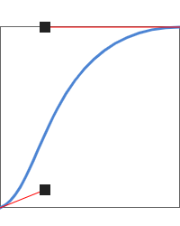
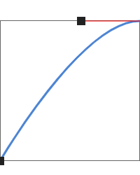
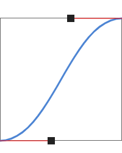

# Timing Functions for CSS Animations and Transitions

| Graph                                                   | Timing Function | Cubic Bezier                         |
|:--------------------------------------------------------|:----------------|:-------------------------------------|
|                | `ease`          | `cubic-bezier(0.25, 0.1, 0.25, 1.0)` |
|          | `ease-in`       | `cubic-bezier(0.42, 0.0, 1.0, 1.0)`  |
|        | `ease-out`      | `cubic-bezier(0.0, 0.0, 0.58, 1.0)`  |
|  | `ease-in-out`   | `cubic-bezier(0.42, 0.0, 0.58, 1.0)` |
|            | `linear`        | `cubic-bezier(0.0, 0.0, 1.0, 1.0)`   |
